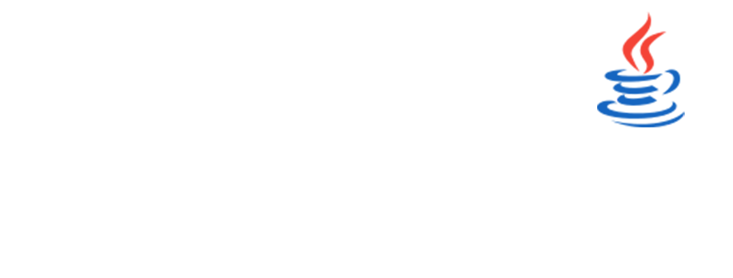
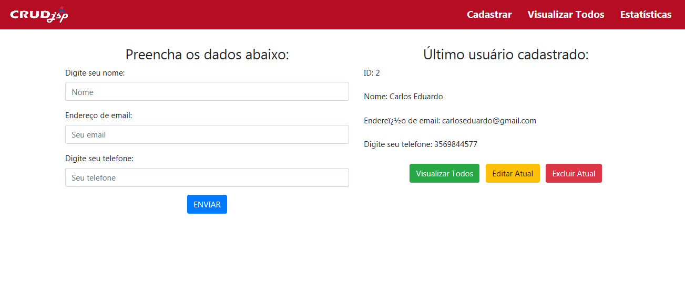
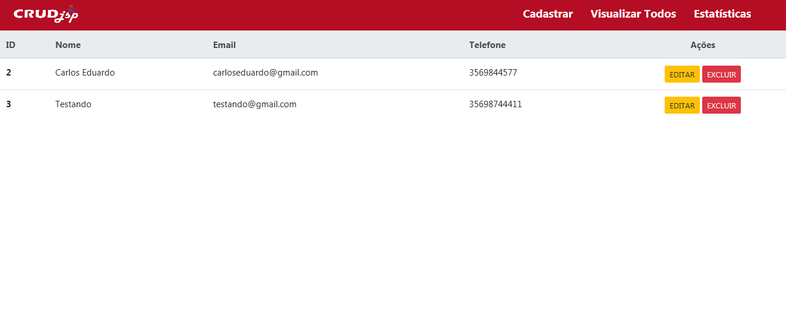
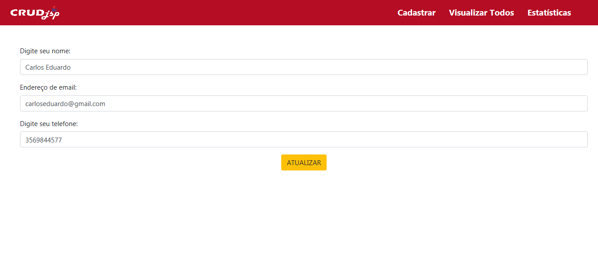

 
 
 

 
 
<h2>Fotos:</h2>

Home

 

Visualização dos dados

 

Update

 
 
 

Antes de começar esteja ciente que pode dar alguns erros de conexão com o banco de dados se acontecer verifique a url de conexão na pasta src/java/Classes. Você precisará ter instalado em sua máquina o seguite:

<ul>
    <a href="https://git-scm.com">Git: 
    https://git-scm.com</a>
     
    <a href="http://netbeans.apache.org/download/index.html">NetBeans 
    http://netbeans.apache.org/download/index.html</a>    
     
    <a href="https://download.oracle.com/glassfish/4.0/release/glassfish-4.0-web-windows.exe">
    GlassFish Versão 4
     https://download.oracle.com/glassfish/4.0/release/glassfish-4.0-web-windows.exe</a>
      
     <a href="https://java-2-runtime-environment.br.uptodown.com/windows/download">
    Java
     https://java-2-runtime-environment.br.uptodown.com/windows/download</a>
</ul>

### Rodando o Site

<ul>
    <li>Entre no netbeans e clique em file->open project e selecione a pasta do projeto.</li>
    <li>A IDE vai demorar um pouco pra carregar o projeto.</li>
    <li>Configure seu banco de dados. </li>
    <li>OS comandos de execução estão na pasta raiz do projeto com nome database.sql.</li>
    <li>Caso o botão de play não pareca pra você ao iniciar o projeto. Configure o Glassfish Server no Netbeans.</li>
</ul>

### Tecnologias

As seguintes ferramentas foram usadas na construção do projeto:

<ul>
    <li>Java</li>
    <li>HTML</li>
    <li>CSS</li>
</ul>

### Autor

<a href="">
 
  
 <b>Carlos Eduardo</b></a>

Feito com ❤️ por Carlos Eduardo

<a href="mailto:carloseduardodiasbatista@gmail.com">Entre em contato</a>

